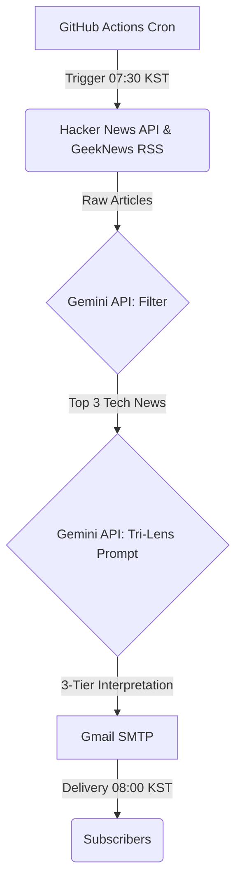

# Tri-Lens Daily News
> An automated pipeline that delivers AI/tech news every morning, dynamically translated into three depth levels for different personas.

## 💡 Motivation (The Problem)

- **Information Overload**: The AI and tech landscape moves too fast. Manually filtering daily updates across Hacker News and RSS feeds is extremely time-consuming.
- **Context Mismatch**: Existing tech newsletters are "one-size-fits-all." They are either too superficial for developers/researchers or too jargon-heavy for the general public.

To solve this, I built a zero-cost pipeline that curates the noise and uses LLMs to dynamically translate the *same* information into three distinct contexts.

## 🎯 Solution (What it does)

Every morning at 8:00 KST, it collects top stories from Hacker News and GeekNews, selects 3 AI/tech-relevant articles via Gemini API, generates three-tier interpretations, and emails the result in Korean.

- 🌐 **Everyone** — No jargon, everyday impact
- 💻 **Developers** — Technical stacks, implementation implications
- 🔬 **Researchers** — Academic context, open problems

### 📩 Example Output
*(Add screenshot or code block of the actual email here)*

## 🏗️ Architecture & Data Flow

## 🛠️ Tech Stack & Decisions

| Component | Choice | Why this over alternatives? |
| --------- | ------ | --------------------------- |
| **Scheduler** | GitHub Actions cron | Serverless, zero maintenance, free for public repos. |
| **AI Model** | Gemini 2.5 Flash | Free tier allows 15 RPM (sufficient for 3 articles/day), high context window. |
| **Delivery** | Gmail SMTP | Universal protocol, requires zero app installation for end-users. |

Monthly cost: **$0**

## 🛠️ Prompt Engineering & Troubleshooting

**Challenge:** Initial implementations suffered from the classic "LLM Preamble" issue (e.g., *"Sure, I will translate this news for you..."*) and generated markdown syntax that broke Gmail's HTML rendering.

**Solution:** The prompt was completely refactored using a research-backed structure ([Google's prompting guide](https://ai.google.dev/gemini-api/docs/prompting-strategies), [Anthropic's best practices](https://docs.anthropic.com/en/docs/build-with-claude/prompt-engineering)):
- **XML tags**: Separated role, task, constraints, and output format to prevent context leakage.
- **Few-shot anchoring**: Provided a strict 1-shot example to enforce the exact tone without greetings.
- **Negative constraints**: Explicitly banned markdown, repetitive phrases, and strictly limited each lens to 2 sentences.

## ⏱️ Infra Optimizations & Known Limitations

- **Cron Timing Delay**: GitHub Actions cron can delay 5–30 minutes under heavy global load. To guarantee 8:00 AM KST delivery, the job trigger was proactively shifted to 7:30 AM KST (22:30 UTC).
- **Duplicate News Filtering (Pending)**: Occasionally, different RSS sources report the exact same news. Deduplication logic is currently being researched for the next release.
- **Email Link Preview**: News URLs are currently plain text links; rendering depends entirely on the email client's native behavior.

## 🚀 Quick Start (Setup)

1. Get a [Gemini API key](https://aistudio.google.com/) (free, no credit card)
2. Create a [Gmail App Password](https://myaccount.google.com/apppasswords)
3. Fork this repo (keep it **public** for free Actions minutes)
4. Add 4 secrets in Settings → Secrets → Actions:
   - `GEMINI_API_KEY`
   - `GMAIL_ADDRESS`
   - `GMAIL_APP_PASSWORD`
   - `RECIPIENTS` (comma-separated emails)
5. Go to Actions tab → Run workflow → Check your inbox

## 📈 Roadmap & Maintenance

As of July 2026, this project is actively maintained to explore advanced LLM evaluation and data-centric pipelines:
- **LLM-as-a-Judge Evaluation Pipeline**: Implementing an automated scoring system to evaluate the 'Faithfulness' and 'Readability' of the generated summaries before dispatch, ensuring output quality without human intervention.
- **User Feedback Loop**: Integrating in-email telemetry (e.g., Thumbs Up/Down) backed by a lightweight DB (Supabase) to collect user satisfaction metrics. This data will establish a continuous prompt optimization cycle.
- **Multi-Agent Cross-checking**: Planning to transition from a single-pass prompt to a multi-agent validation architecture to minimize hallucination in highly technical news.

## 📄 License

This project is licensed under the MIT License - see the [LICENSE](LICENSE) file for details.
