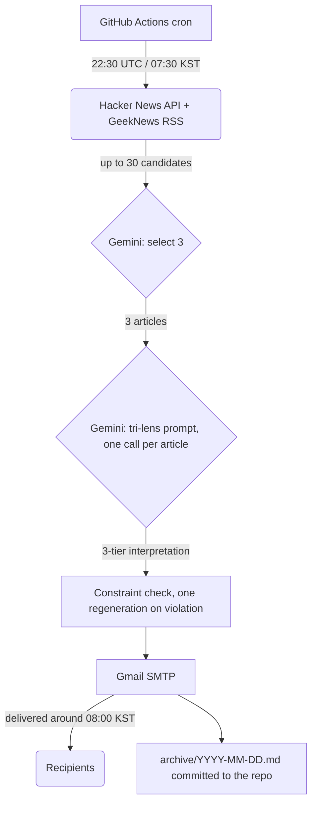

# Tri-Lens Daily News

An automated pipeline that emails AI and tech news every morning, interpreted at three depths for three different readers.

## Motivation

Filtering AI and tech news by hand across Hacker News and RSS feeds takes time every single morning, and the newsletters that do it for you are written for one audience. They are either too shallow to tell a developer anything actionable or too dense for someone outside the field.

The observation behind this project is that the gap is usually not the news, it is the framing. The same story matters differently to a general reader, an engineer, and a researcher. So rather than pick different stories per audience, this pipeline picks the same three stories and rewrites each one three ways.

## What It Does

Every morning it collects the top stories from Hacker News and GeekNews, asks Gemini to pick the three most relevant to AI and software, generates a three-lens interpretation of each, and emails the result in Korean.

- **Everyone** - everyday impact, no jargon
- **Developers** - stacks, implementation consequences
- **Researchers** - open problems and research direction

Each lens is capped at two sentences, and the prompt requires the three to differ in sentence structure so the reader is not shown the same paragraph three times.

## Architecture

```mermaid
graph TD
    A[GitHub Actions cron] -->|22:30 UTC / 07:30 KST| B(Hacker News API + GeekNews RSS)
    B -->|up to 30 candidates| C{Gemini: select 3}
    C -->|3 articles| D{Gemini: tri-lens prompt, one call per article}
    D -->|3-tier interpretation| V[Constraint check, one regeneration on violation]
    V --> E[Gmail SMTP]
    E -->|delivered around 08:00 KST| F(Recipients)
    E --> G[archive/YYYY-MM-DD.md committed to the repo]
```

Four Gemini calls run per day, one to select and three to interpret, plus one more for each interpretation that fails the constraint check. Everything lives in a single script with no database and no server.

Two support jobs sit alongside it. A failed run emails the sending account rather than the recipient list, so an outage reaches the maintainer and not the readers. A monthly keepalive pushes an empty commit if the repository has been quiet for 50 days, which is what stops GitHub from disabling the schedule for inactivity. Delivered digests are committed daily under [`archive/`](archive), so in ordinary operation the keepalive never fires; it matters only when the pipeline has been broken long enough to stop committing on its own.

## Tech Decisions

| Component | Choice | Why this over alternatives |
| --- | --- | --- |
| Scheduler | GitHub Actions cron | Serverless with no instance to keep alive, and free on a public repo. The tradeoff is that the schedule is best-effort, which is handled below |
| Model | Gemini 3.6 Flash | Four calls a day sit far inside any free-tier allowance, and the context window fits a full candidate list in one prompt. Set the `GEMINI_MODEL` repository variable to override it without a commit, which is the escape hatch if a model leaves the free tier |
| Delivery | Gmail SMTP | Email needs nothing installed and no account created. A web app or a bot would have put a step between the reader and the content |
| Storage | Markdown files in the repo (over a database) | What needs to persist is the digest that was sent, which is text, read rarely, and never queried. A database would add a service to keep alive in a project whose defining failure was something going quiet unattended. The cost is a commit per delivered day and a repository that grows, slowly, forever |
| Alerting | A step in the same workflow (over a hosted monitor) | An external monitor is one more unattended account that can go quiet, which is the exact failure being guarded against. Reusing the SMTP secrets adds no new surface and no new service. The cost is that it cannot report a run that never starts, which is what the keepalive covers instead |
| Validation | Rule checks (over an LLM judge) | The constraint block is stated literally enough to test mechanically, so a judge would add a call, a cost, and a second thing that can be wrong in exchange for a less reliable version of the same answer. A judge earns its place on faithfulness, which is blocked on the article text |

Choices made from 2026-08-13 onward are recorded in full, with the conditions that should reopen them, in [docs/decisions.md](docs/decisions.md).

Monthly cost is $0. Every component sits inside a free tier at this volume.

## Prompt Engineering

Early versions produced the usual failure modes: a preamble before the answer ("Sure, I will translate this news for you"), and markdown syntax that Gmail rendered as literal asterisks.

The prompt was restructured around three techniques, following [Google's prompting guide](https://ai.google.dev/gemini-api/docs/prompting-strategies) and [Anthropic's best practices](https://docs.anthropic.com/en/docs/build-with-claude/prompt-engineering):

- **XML tags** separate role, task, constraints, and output format so instructions do not bleed into each other
- **One-shot anchoring** with a full worked example fixes the tone and proves that the answer starts immediately, with no greeting
- **Negative constraints** ban markdown, ban a list of filler phrases that kept recurring, and hold each lens to exactly two sentences

## Results & Limitations

The pipeline ran daily from 2026-04-02 to 2026-06-04 at no cost, 64 scheduled runs of which 60 were recorded as successful. It then sat dead for ten weeks, and the more useful result is that nobody noticed when it stopped. That is the silent-failure gap below turning into an actual outage: with no alerting, an unattended job that quits looks exactly like an unattended job that works. The success count carries the same caveat, because until recently a run that collected nothing and sent nothing would have been counted among them.

Delivery resumed on 2026-08-13, verified by a manual run that collected 30 candidates, selected 3, and sent the mail in 1m20s.

Beyond cost, **almost nothing has been measured**. The prompt constraints used to be enforced by the prompt alone, so a violation would ship; they are now checked before dispatch by rule rather than by judgment, at no API cost, and a violating interpretation is regenerated once with its violations fed back. The checks cover what the constraint block states literally: no preamble, all three lenses present and in order, exactly two sentences each, no markdown. One constraint stays unchecked, that the three lenses differ in sentence structure, because it has no mechanical test.

What went out is now kept. Every delivered digest is committed under [`archive/`](archive) from 2026-08-13 onward, which is the corpus a later scoring pass would need. Earlier days are unrecoverable, because they were never written down anywhere.

Each archived day ends with a line recording how many model calls it took, how many retries those calls consumed against a budget of three, and how many interpretations passed the constraint check. Retries are handled below the application and leave nothing behind on their own, so a call that succeeded on its third attempt used to look exactly like one that succeeded on its first. That line is the difference between a pipeline that is healthy and one that has been running on its last attempt for a week.

Everything else stands. There is no record of run successes and failures beyond the Actions tab, which drops its logs after 90 days, no evaluation of whether the interpretations are faithful to the articles, and no reader feedback.

Known gaps, all present in the current code:

- **The model never sees the article.** `generate_trilens` passes the title and the URL, and `generateContent` does not browse, so every interpretation is written from a headline. This is the largest gap in the project. It also blocks faithfulness scoring, because there is no source text in context for an interpretation to be measured against.

- **Model calls retry on 5xx only.** `call_gemini` used to post directly, so a single transient 5xx ended that morning's run, which is what happened on 2026-08-13 when Gemini returned 503 on the first interpretation. It now goes through the retry session, which required adding POST to the retried methods because urllib3 leaves non-idempotent methods out by default. A 429 from an exhausted quota is still not retried and still ends the run.
- **The selection response is parsed strictly.** The model is asked for JSON and the reply goes to `json.loads` with no fallback, so a malformed answer stops the run rather than degrading to a default pick.
- **Alerting covers failed runs, not absent ones.** A failed run emails the sending account, so a strict-parse error, a model error, or the fewer-than-three-stories exit surfaces the same morning. A run that never starts still announces nothing, because there is no job to send the alert from. The keepalive removes the one cause of that seen so far, but an Actions outage would pass unnoticed exactly as before.
- **No cross-source deduplication.** Hacker News and GeekNews regularly carry the same story under different titles, and nothing detects that they are the same. Selecting one list position twice is prevented, but two positions pointing at the same underlying story are not.
- **Delivery time is approximate.** GitHub Actions cron can lag 5 to 30 minutes under load. Triggering at 07:30 KST to land near 08:00 is a mitigation, not a guarantee.

## Getting Started

1. Get a [Gemini API key](https://aistudio.google.com/) (free, no credit card).
2. Create a [Gmail App Password](https://myaccount.google.com/apppasswords).
3. Fork this repo. Keep it public so Actions minutes stay free.
4. Add four secrets under Settings, Secrets, Actions:
   - `GEMINI_API_KEY`
   - `GMAIL_ADDRESS`
   - `GMAIL_APP_PASSWORD`
   - `RECIPIENTS` (comma-separated)
5. Optionally set a `GEMINI_MODEL` repository variable under Settings, Variables, Actions to pin a different model. Leaving it unset uses the default in the script.
6. Open the Actions tab, run the workflow manually, and check your inbox.

## Roadmap

The limitations above set the order. Failure visibility and constraint checking are in place, so what remains of measurement is the half that cannot be decided by rule, and that half starts with a prerequisite rather than a metric.

- **Article text in context**: fetch the article body and pass it to the interpretation prompt. Everything today is written from a headline, which makes this both the largest quality gap and the prerequisite for the item below.
- **Faithfulness scoring**: score each interpretation against its source and log the result. This needs a metric definition and the reason for it, a rubric, and a small human-labeled set to check the scorer against. None of those exist yet, and reporting a number before they do would be decoration.
- **Deduplication**: collapse the same story arriving from both sources before selection.
- **Reader feedback**: a thumbs up or down in the email, stored somewhere light, to check whether the three-lens split is actually useful or just a nice idea.

## Status

Delivering. Ran daily from 2026-04-02 to 2026-06-04, then stopped for ten weeks because GitHub disabled the workflow under its inactivity rule for scheduled jobs. That is a third shape of silent failure and the one that actually happened: there is no failed run to alert on, because there is no run at all. The schedule is enabled again, a manual run on 2026-08-13 delivered, and the keepalive job now covers the cause. Last reviewed 2026-08-13.

## License

MIT. See [LICENSE](LICENSE).
