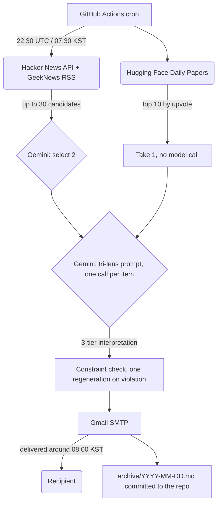

# Tri-Lens Daily News

An automated pipeline that emails two AI news items and one paper every morning, each interpreted at three depths so a reader can climb from one to the next.

## Motivation

I wanted to keep up with AI news and the papers behind it, and the papers were the part I could not do. Opening an abstract cold, without knowing which of its terms were the point and which were background, meant reading it twice and understanding it neither time. Summaries written for practitioners assume the context I was missing; summaries written for everyone leave out the part I was trying to reach.

So the three lenses are not three audiences. They are one reader climbing. **Everyone** says what happened in plain language, **Developers** says what it does mechanically, **Researchers** says what is still unsettled. Read in order, the first two are the run-up that makes the third readable. There is exactly one subscriber, and this is a tool built for them.

## What It Does

Every morning it collects candidates from Hacker News, GeekNews, and Hugging Face Daily Papers, then assembles a fixed digest of three items.

- **Two news items**, chosen by Gemini from the news sources for relevance to AI and software
- **One paper**, taken by upvote from the day's curated paper list

Each item is rewritten through three lenses:

- **Everyone** - everyday impact, no jargon
- **Developers** - stacks, implementation consequences
- **Researchers** - open problems and research direction

The paper slot is fixed rather than left to compete, because a paper title never wins a relevance contest against a product headline, and the Researchers lens has nothing real to say about a product launch. Each lens is capped at two sentences.

## Architecture

```mermaid
graph TD
    A[GitHub Actions cron] -->|22:30 UTC / 07:30 KST| B(Hacker News API + GeekNews RSS)
    A --> P(Hugging Face Daily Papers)
    B -->|up to 30 candidates| C{Gemini: select 2}
    P -->|top 10 by upvote| Q[Take 1, no model call]
    C --> D{Gemini: tri-lens prompt, one call per item}
    Q --> D
    D -->|3-tier interpretation| V[Constraint check, one regeneration on violation]
    V --> E[Gmail SMTP]
    E -->|delivered around 08:00 KST| F(Recipient)
    E --> G[archive/YYYY-MM-DD.md committed to the repo]
```

Four Gemini calls run per day, one to select the news and three to interpret, plus one more for each interpretation that fails the constraint check. The paper is chosen without a model call, since the candidates are already human-curated and carry upvotes. Everything lives in a single script with no database and no server.

Two support jobs sit alongside it. A failed run emails the sending account rather than the recipient list, which keeps the boundary in place for whenever that list holds someone other than the person who maintains this. A monthly keepalive pushes an empty commit if the repository has been quiet for 50 days, which is what stops GitHub from disabling the schedule for inactivity. Delivered digests are committed daily under [`archive/`](archive), so in ordinary operation the keepalive never fires; it matters only when the pipeline has been broken long enough to stop committing on its own.

## Tech Decisions

| Component | Choice | Why this over alternatives |
| --- | --- | --- |
| Sources | Hacker News · GeekNews · Hugging Face Daily Papers (over raw arXiv) | The first two carry no research, which left one of the three lenses with nothing to say. Raw arXiv returns several hundred papers a day in one category with nothing to rank them by, while the curated list is ordered by upvote and ships the abstract. The cost is that the paper feed is the least stable dependency here, being an undocumented endpoint rather than a published API |
| Scheduler | GitHub Actions cron | Serverless with no instance to keep alive, and free on a public repo. The tradeoff is that the schedule is best-effort, which is handled below |
| Model | Gemini 3.6 Flash, behind a provider table | Four calls a day sit far inside any free-tier allowance, and the context window fits a full candidate list in one prompt. Everything a provider does differently is four values in one table, so the calling code names no vendor. Set the `LLM_PROVIDER` and `LLM_MODEL` repository variables to switch without a commit, which is the escape hatch if a model leaves the free tier |
| Delivery | Gmail SMTP | Email needs nothing installed and no account created. A web app or a bot would have put a step between the reader and the content |
| Storage | Markdown files in the repo (over a database) | What needs to persist is the digest that was sent, which is text, read rarely, and never queried. A database would add a service to keep alive in a project whose defining failure was something going quiet unattended. The cost is a commit per delivered day and a repository that grows, slowly, forever |
| Alerting | A step in the same workflow (over a hosted monitor) | An external monitor is one more unattended account that can go quiet, which is the exact failure being guarded against. Reusing the SMTP secrets adds no new surface and no new service. The cost is that it cannot report a run that never starts, which is what the keepalive covers instead |
| Validation | Rule checks (over an LLM judge) | The constraint block is stated literally enough to test mechanically, so a judge would add a call, a cost, and a second thing that can be wrong in exchange for a less reliable version of the same answer. A judge earns its place on faithfulness, which is blocked on the article text |

Choices made from 2026-08-13 onward are recorded in full, with the conditions that should reopen them, in [docs/decisions.md](docs/decisions.md).

Monthly cost is $0. Every component sits inside a free tier at this volume.

## Prompt Engineering

Early versions produced the usual failure modes: a preamble before the answer ("Sure, I will translate this news for you"), and markdown syntax that Gmail rendered as literal asterisks.

The prompt was restructured around three techniques, following [Google's prompting guide](https://ai.google.dev/gemini-api/docs/prompting-strategies) and [Anthropic's best practices](https://docs.anthropic.com/en/docs/build-with-claude/prompt-engineering):

- **XML tags** separate role, task, constraints, and output format so instructions do not bleed into each other
- **One-shot anchoring** with a full worked example fixes the tone and proves that the answer starts immediately, with no greeting
- **Negative constraints** ban markdown, ban a list of filler phrases that kept recurring, and hold each lens to exactly two sentences
- **Carry-forward between lenses** tells the model that one reader is going top to bottom, so a lens names the thing the lens above it described in plain words. Before this, an interpretation could explain majority voting over samples and then reintroduce it two lines later as an unglossed term, which is the exact moment a reader loses the thread
- **Terms in English with a bounded gloss** because a transliteration cannot be searched, and the reader here is the one trying to learn the field. The first version of this rule glossed everything, including `weight` and `VRAM`, so it now names the case it is for and caps glosses at two per lens

## Results & Limitations

The pipeline ran daily from 2026-04-02 to 2026-06-04 at no cost, 64 scheduled runs of which 60 were recorded as successful. It then sat dead for ten weeks, and the more useful result is that nobody noticed when it stopped. That is the silent-failure gap below turning into an actual outage: with no alerting, an unattended job that quits looks exactly like an unattended job that works. The success count carries the same caveat, because until recently a run that collected nothing and sent nothing would have been counted among them.

Delivery resumed on 2026-08-13, verified by a manual run that collected 30 candidates, selected 3, and sent the mail in 1m20s.

Beyond cost, **almost nothing has been measured**. The prompt constraints used to be enforced by the prompt alone, so a violation would ship; they are now checked before dispatch by rule rather than by judgment, at no API cost, and a violating interpretation is regenerated once with its violations fed back. The checks cover what the constraint block states literally: no preamble, all three lenses present and in order, exactly two sentences each, no markdown. The rules added since, that a lens carries forward from the one above it and that glosses stay bounded, have no mechanical test and are enforced by the prompt alone. They were judged by reading the output before and after, which is not measurement.

What went out is now kept. Every delivered digest is committed under [`archive/`](archive) from 2026-08-13 onward, which is the corpus a later scoring pass would need. Earlier days are unrecoverable, because they were never written down anywhere.

Each archived day ends with a line recording how many model calls it took, how many retries those calls consumed against a budget of three, and how many interpretations passed the constraint check. Retries are handled below the application and leave nothing behind on their own, so a call that succeeded on its third attempt used to look exactly like one that succeeded on its first. That line is the difference between a pipeline that is healthy and one that has been running on its last attempt for a week.

Everything else stands. There is no record of run successes and failures beyond the Actions tab, which drops its logs after 90 days, no evaluation of whether the interpretations are faithful to the articles, and no reader feedback.

Known gaps, all present in the current code:

- **The model now sees the news body, and how often that works is not yet a number.** The two news items are fetched and passed as extracted article text, as the paper's abstract already was, so all three interpretations can in principle be checked against a source rather than one in three. The fetch first ran end to end on 2026-08-14: of four attempts that day three returned a usable body, and the fourth extracted zero characters from a Hacker News link. Four attempts on one day is not a rate, and the linked domain changes daily, so the count at the foot of each archived digest is the thing to watch before designing around it.

- **Model calls retry on 5xx only.** `call_model` used to post directly, so a single transient 5xx ended that morning's run, which is what happened on 2026-08-13 when Gemini returned 503 on the first interpretation. It now goes through the retry session, which required adding POST to the retried methods because urllib3 leaves non-idempotent methods out by default. A 429 from an exhausted quota is still not retried and still ends the run, which is what ended the scheduled run on 2026-08-14. Failed calls now log the response body, because the raised error carries the status and the URL while the name of the exhausted quota sits in the body, and without it a per-minute limit and a daily one look identical in the log.
- **The selection response is parsed strictly.** The model is asked for JSON and the reply goes to `json.loads` with no fallback, so a malformed answer stops the run rather than degrading to a default pick.
- **Alerting covers failed runs, not absent ones.** A failed run emails the sending account, so a strict-parse error, a model error, or the fewer-than-three-stories exit surfaces the same morning. A run that never starts still announces nothing, because there is no job to send the alert from. The keepalive removes the one cause of that seen so far, but an Actions outage would pass unnoticed exactly as before.
- **No cross-source deduplication.** Hacker News and GeekNews regularly carry the same story under different titles, and nothing detects that they are the same. Selecting one list position twice is prevented, but two positions pointing at the same underlying story are not.
- **Delivery time is approximate.** GitHub Actions cron can lag 5 to 30 minutes under load. Triggering at 07:30 KST to land near 08:00 is a mitigation, not a guarantee.

## Getting Started

1. Get a [Gemini API key](https://aistudio.google.com/) (free, no credit card).
2. Create a [Gmail App Password](https://myaccount.google.com/apppasswords).
3. Fork this repo. Keep it public so Actions minutes stay free.
4. Add four secrets under Settings, Secrets, Actions:
   - `GEMINI_API_KEY`
   - `GMAIL_ADDRESS`
   - `GMAIL_APP_PASSWORD`
   - `RECIPIENTS` (comma-separated)
5. Optionally set `LLM_PROVIDER` and `LLM_MODEL` repository variables under Settings, Variables, Actions to pin a different provider or model. Leaving them unset uses the defaults in the script. A provider other than `gemini` needs its own key added as a secret, `GROQ_API_KEY` for `groq`; the key for a provider you do not use can stay absent.
6. Open the Actions tab, run the workflow manually, and check your inbox.

## Roadmap

The limitations above set the order. Failure visibility, constraint checking, and article text in context are in place, so what remains of measurement is the half that cannot be decided by rule. Its prerequisite is met: there is now a source to check each of the three interpretations against.

- **Faithfulness scoring**: score each interpretation against its source and log the result. The metric, the rubric, the labelling procedure, and the agreement threshold a judge has to clear before its numbers are reported are written down in [docs/evaluation.md](docs/evaluation.md). Nothing has been labelled yet; the archive that supplies the sample started on 2026-08-13.
- **Deduplication**: collapse the same story arriving from both sources before selection.
- **Reader feedback**: a thumbs up or down in the email, stored somewhere light, to check whether the three-lens split is actually useful or just a nice idea.

## Status

Delivering. Ran daily from 2026-04-02 to 2026-06-04, then stopped for ten weeks because GitHub disabled the workflow under its inactivity rule for scheduled jobs. That is a third shape of silent failure and the one that actually happened: there is no failed run to alert on, because there is no run at all. The schedule is enabled again and the keepalive job now covers the cause. The scheduled run on 2026-08-14 ended on a 429 at its first interpretation, and a manual run eight hours later delivered. Which quota was exhausted is not known, since the run before it had made one successful call and the error body was being discarded at the time. Last reviewed 2026-08-14.

## License

MIT. See [LICENSE](LICENSE).
