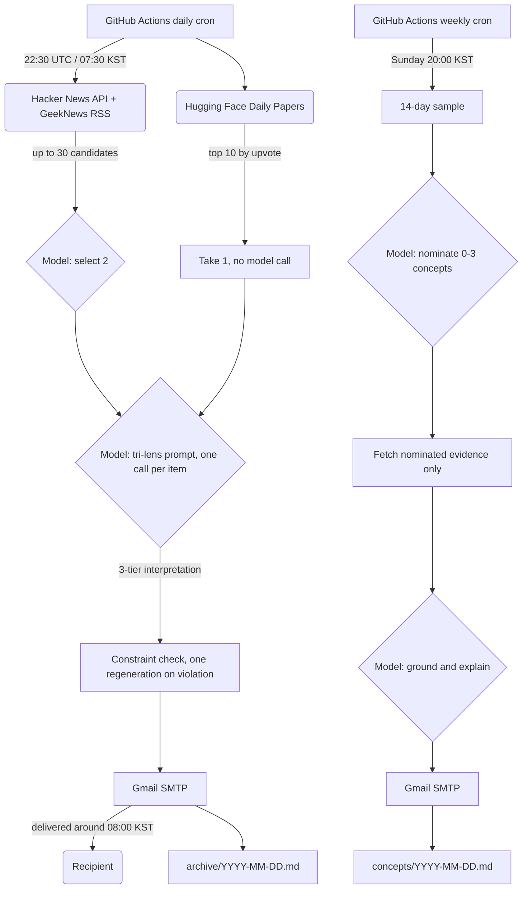

# Tri-Lens News

> An automated pipeline that emails two AI news items and one paper every morning, each interpreted at three depths so a reader can climb from one to the next.

## Motivation

I wanted to keep up with AI news and the papers behind it, and the papers were the part I could not do. Opening an abstract cold, without knowing which of its terms were the point and which were background, meant reading it twice and understanding it neither time. Summaries written for practitioners assume the context I was missing; summaries written for everyone leave out the part I was trying to reach.

So the three lenses are not three audiences. They are one reader climbing. **Everyone** says what happened in plain language, **Developers** says what it does mechanically, **Researchers** says what is still unsettled. Read in order, the first two are the run-up that makes the third readable. There is exactly one subscriber, and this is a tool built for them.

A second problem appears more slowly than a headline: the field starts using a term before it becomes obvious that the term is now part of the working vocabulary. The weekly **Concept Radar** looks for that layer without turning the project into another general-purpose news feed.

## What It Does

Every morning it collects candidates from Hacker News, GeekNews, and Hugging Face Daily Papers, drops whatever already went out in the last seven days, then assembles a fixed digest of three items.

- **Two news items**, chosen by Gemini from the news sources for relevance to AI and software
- **One paper**, taken by upvote from the day's curated paper list

Each item is rewritten through three lenses:

- **Everyone** - everyday impact, no jargon
- **Developers** - stacks, implementation consequences
- **Researchers** - open problems and research direction

The paper slot is fixed rather than left to compete, because a paper title never wins a relevance contest against a product headline, and the Researchers lens has nothing real to say about a product launch. Each lens is capped at two sentences.

Once a week, Concept Radar samples the previous 14 days of high-signal Hacker News stories, the current GeekNews feed, and the digests that were actually delivered. It nominates at most three reusable AI/ML/software-engineering terms, fetches only the evidence articles needed to check those nominations, and emails a short definition, why the term matters now in the sampled material, where an engineer is likely to meet it, and the supporting links. Terms sent in the previous 90 days are suppressed so the Radar stays a discovery layer rather than a glossary that repeats itself.

## Architecture

```mermaid
graph TD
    A[GitHub Actions daily cron] -->|22:30 UTC / 07:30 KST| B(Hacker News API + GeekNews RSS)
    A --> P(Hugging Face Daily Papers)
    B -->|up to 30 candidates| C{Model: select 2}
    P -->|top 10 by upvote| Q[Take 1, no model call]
    C --> D{Model: tri-lens prompt, one call per item}
    Q --> D
    D -->|3-tier interpretation| V[Constraint check, one regeneration on violation]
    V --> E[Gmail SMTP]
    E -->|delivered around 08:00 KST| F(Recipient)
    E --> G[archive/YYYY-MM-DD.md]

    W[GitHub Actions weekly cron] -->|Sunday 20:00 KST| H[14-day sample]
    H --> I{Model: nominate 0-3 concepts}
    I --> J[Fetch nominated evidence only]
    J --> K{Model: ground and explain}
    K --> L[Gmail SMTP]
    L --> M[concepts/YYYY-MM-DD.md]
```

The daily path normally makes four model calls: one to select the news and three to interpret, plus one more for each interpretation that fails the constraint check. The paper is chosen without a model call, since the candidates are already human-curated and carry upvotes. Concept Radar normally makes two model calls per weekly run: nomination, then evidence-grounded explanation. It sends nothing when no term survives the second stage.

There is no database and no server. The daily and weekly jobs are separate scripts so a Radar failure cannot break the morning digest. Both keep only delivered output in the repository; article bodies used for grounding are fetched transiently and are not stored.

Two support jobs sit alongside them. A failed run emails the sending account rather than the recipient list, which keeps the boundary in place for whenever that list holds someone other than the person who maintains this. A monthly keepalive pushes an empty commit if the repository has been quiet for 50 days, which is what stops GitHub from disabling the schedule for inactivity. Delivered daily digests are committed under [`archive/`](archive); delivered Concept Radars are committed under `concepts/`.

## Tech Decisions

| Component | Choice | Why this over alternatives |
| --- | --- | --- |
| Daily sources | Hacker News · GeekNews · Hugging Face Daily Papers (over raw arXiv) | The first two carry no research, which left one of the three lenses with nothing to say. Raw arXiv returns several hundred papers a day in one category with nothing to rank them by, while the curated list is ordered by upvote and ships the abstract. The cost is that the paper feed is the least stable dependency here, being an undocumented endpoint rather than a published API |
| Concept discovery | Weekly 14-day sample from HN Search, GeekNews, and delivered digests | Emerging vocabulary is slower than a headline. A weekly pass can notice terms that recur across days without adding a fourth daily slot. HN is filtered by age and points before the model sees titles; only nominated evidence is fetched in full. The result is a sampled radar, not a claim about field-wide frequency |
| Scheduler | GitHub Actions cron | Serverless with no instance to keep alive, and free on a public repo. The tradeoff is that the schedule is best-effort, which is handled below |
| Model | Gemini 3.6 Flash, behind a provider table | Daily and weekly calls sit far inside the current free-tier allowance, and the context window fits the candidate lists. Everything a provider does differently is isolated behind one table, so both scripts can share the same model path. Set `LLM_PROVIDER` and `LLM_MODEL` repository variables to switch without a commit |
| Delivery | Gmail SMTP | Email needs nothing installed and no account created. A web app or a bot would have put a step between the reader and the content |
| Storage | Markdown files in the repo (over a database) | What needs to persist is delivered text, written rarely and read directly. A database would add a service to keep alive in a project whose defining failure was something going quiet unattended. The cost is a repository that grows, slowly, forever |
| Alerting | A step in the same workflow (over a hosted monitor) | An external monitor is one more unattended account that can go quiet, which is the exact failure being guarded against. Reusing the SMTP secrets adds no new surface and no new service. The cost is that it cannot report a run that never starts, which is what the keepalive covers instead |
| Validation | Rule checks for tri-lens format; source grounding for Concept Radar | The daily constraint block is literal enough to test mechanically, so a judge model would be weaker than rules. Concept Radar asks a different question: whether a term is actually supported by recent source material, so it uses a second grounded pass over nominated evidence rather than accepting title-only guesses |

Choices made from 2026-08-13 onward are recorded in full where a decision needs a reopen condition, in [docs/decisions.md](docs/decisions.md).

Monthly cost is $0 at the current volume and provider configuration.

## Prompt Engineering

Early versions produced the usual failure modes: a preamble before the answer ("Sure, I will translate this news for you"), and markdown syntax that Gmail rendered as literal asterisks.

The prompt was restructured around five techniques, following [Google's prompting guide](https://ai.google.dev/gemini-api/docs/prompting-strategies) and [Anthropic's best practices](https://docs.anthropic.com/en/docs/build-with-claude/prompt-engineering):

- **XML tags** separate role, task, constraints, and output format so instructions do not bleed into each other
- **One-shot anchoring** with a full worked example fixes the tone and proves that the answer starts immediately, with no greeting
- **Negative constraints** ban markdown, ban a list of filler phrases that kept recurring, and hold each lens to exactly two sentences
- **Carry-forward between lenses** tells the model that one reader is going top to bottom, so a lens names the thing the lens above it described in plain words. Before this, an interpretation could explain majority voting over samples and then reintroduce it two lines later as an unglossed term, which is the exact moment a reader loses the thread
- **Terms in English with a bounded gloss** because a transliteration cannot be searched, and the reader here is the one trying to learn the field. The first version of this rule glossed everything, including `weight` and `VRAM`, so it now names the case it is for and caps glosses at two per lens

Concept Radar uses a different two-stage prompt. The first pass can only nominate terms that appear in the sampled titles or delivered interpretations. The second pass receives the nominated evidence text and is allowed to drop a term if it turns out to be a product label, a title-only guess, or too weakly supported. It is also told not to describe the sample as an industry-wide frequency measurement.

## Results & Limitations

The daily pipeline runs at $0 monthly cost, with all delivered digests committed to [`archive/`](archive) since 2026-08-13. Concept Radar was added on 2026-09-15; only delivered weekly Radars are written to `concepts/`.

- **Automated rule validation**: Prompt formatting (two sentences per lens, ordered tiers, negative constraints) is enforced deterministically via `evaluate.py` with automatic one-time regeneration upon violation.
- **Operational safeguards**: Includes keepalive pushes against GitHub Actions inactivity deactivation, sending-account error alerts, and slot-preserving candidate replacement upon model safety filtering.
- **Concept evidence gate**: The weekly job first nominates terms, then fetches only the cited evidence and asks a second pass to discard unsupported or product-specific candidates before delivery.

Known limitations:

- **Faithfulness is unmeasured**: The interpretation quality against full article bodies has not yet been quantitatively scored. A human labeling rubric and LLM judge agreement framework are defined in [docs/evaluation.md](docs/evaluation.md).
- **Concept Radar is a sample, not a census**: Hacker News is filtered by recent engagement, GeekNews contributes its current RSS window, and delivered digests reflect the project's own editorial selection. A term absent from all three can still matter in the wider field.
- **Delivery timing is best-effort**: GitHub Actions cron execution can delay 5 to 30 minutes under infrastructure load.
- **Deduplication is prompt-based**: Cross-source duplicate detection across Hacker News and GeekNews relies on model judgment rather than semantic embeddings.

Detailed design choices and operational incident history are documented in [docs/decisions.md](docs/decisions.md).

## Getting Started

1. Get a [Gemini API key](https://aistudio.google.com/) (free, no credit card).
2. Create a [Gmail App Password](https://myaccount.google.com/apppasswords).
3. Fork this repo. Keep it public so Actions minutes stay free.
4. Add four secrets under Settings, Secrets, Actions:
   - `GEMINI_API_KEY`
   - `GMAIL_ADDRESS`
   - `GMAIL_APP_PASSWORD`
   - `RECIPIENTS` (comma-separated)
5. Optionally set `LLM_PROVIDER` and `LLM_MODEL` repository variables under Settings, Variables, Actions to pin a different provider or model. Leaving them unset uses the defaults in the script. A provider other than `gemini` needs its own key added as a secret, `GROQ_API_KEY` for `groq`; the key for a provider you do not use can stay absent.
6. Open the Actions tab. `Tri-Lens Daily News` and `Tri-Lens Concept Radar` both support manual dispatch for testing.

## Roadmap

- [x] **Source expansion & article body context**: Integrated Hugging Face Daily Papers and full article body scraping via Trafilatura.
- [x] **Automated constraint validation**: Deterministic formatting and sentence count verification with 1-attempt error feedback regeneration.
- [x] **Cross-day deduplication**: Deterministic 7-day URL filtering and model-based same-event suppression.
- [x] **Concept Radar**: Weekly 14-day vocabulary scan with evidence-grounded explanation and 90-day term suppression.
- [ ] **Faithfulness scoring**: Score interpretation claims against source text using human labels and LLM judge agreement ([docs/evaluation.md](docs/evaluation.md)).
- [ ] **Reader feedback**: Lightweight email reaction link (thumbs up/down) to collect reader utility signal.

## Status

Active. Daily morning digest plus weekly Concept Radar, both delivered by GitHub Actions. The daily archive has been active since 2026-08-13; Concept Radar was added on 2026-09-15. Last updated 2026-09-15.

## License

MIT. See [LICENSE](LICENSE).
